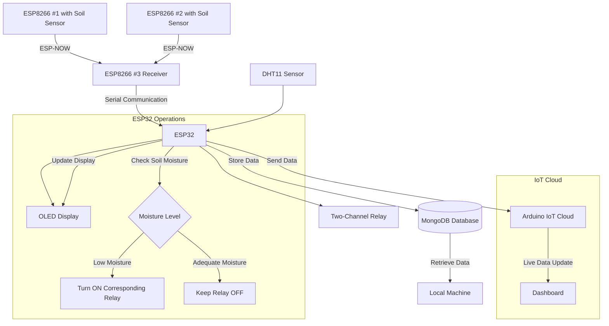

# Smart Irrigation System for Precision Farming


An IoT-based Smart Agriculture System that optimizes irrigation through real-time soil moisture monitoring and automated water management.

## 📌 Table of Contents
- [Project Overview](#project-overview)
- [Features](#features)
- [Hardware Components](#hardware-components)
- [Software & Technologies](#software--technologies)
- [System Architecture](#system-architecture)
- [Installation & Setup](#installation--setup)
- [Usage](#usage)
- [Future Enhancements](#future-enhancements)
- [Contributing](#contributing)
- [License](#license)

## 🌾 Project Overview

This Smart Irrigation System is designed to revolutionize precision farming by leveraging IoT technologies. Our prototype demonstrates the potential for significant water conservation, increased crop yields, and promotion of sustainable farming practices.

## ✨ Features

- **Multi-sensor network**: Utilizes multiple ESP8266s and an ESP32 for comprehensive data collection
- **Real-time monitoring**: Captures soil moisture, temperature, and humidity data
- **Efficient communication**: Implements ESP-NOW protocol for low-power, long-range data transmission
- **Automated irrigation**: Two-channel relay system activates based on real-time soil moisture levels
- **Local visualization**: OLED display shows sensor data and relay status for on-site monitoring
- **Cloud integration**: Live data updates to Arduino IoT Cloud for remote access and monitoring
- **Data persistence**: MongoDB database for storing historical data and enabling future analytics
- **Energy-efficient**: Smart power management for extended battery life in field deployments

## 🛠 Hardware Components

- 3x ESP8266 modules
- 1x ESP32 module
- Soil moisture sensors
- DHT11 temperature and humidity sensor
- Two-channel relay module
- OLED display
- Power supply units

## 💻 Software & Technologies

- Arduino IDE
- ESP-NOW protocol
- Arduino IoT Cloud
- MongoDB
- C++ (for microcontroller programming)

## 🏗 System Architecture



## 🚀 Installation & Setup

1. Clone this repository
2. Set up the hardware components according to the wiring diagram (see `docs/wiring_diagram.pdf`)
3. Install the required libraries in Arduino IDE:
   ```
   - ESP8266WiFi
   - ESP-NOW
   - ArduinoJson
   - Adafruit_SSD1306
   - DHT sensor library
   ```
4. Configure the `config.h` file with your WiFi and IoT Cloud credentials
5. Flash the respective code to each ESP8266 and ESP32 module
6. Set up MongoDB on your local machine and configure the connection string in `database_config.h`

Detailed setup instructions can be found in the `docs/SETUP.md` file.

## 📊 Usage

1. Power on the system
2. Monitor real-time data on the OLED display
3. Access the Arduino IoT Cloud dashboard for remote monitoring and control
4. Analyze historical data using MongoDB queries (scripts available in `scripts/` directory)

## 🔮 Future Enhancements

- Implement machine learning for predictive irrigation
- Expand sensor network to cover larger agricultural areas
- Develop a mobile app for easier monitoring and control
- Integrate weather forecast data for smarter decision-making
- Implement advanced analytics for crop yield prediction

## 🤝 Contributing

We welcome contributions to enhance this project! Please follow these steps:

1. Fork the repository
2. Create a new branch (`git checkout -b feature/AmazingFeature`)
3. Commit your changes (`git commit -m 'Add some AmazingFeature'`)
4. Push to the branch (`git push origin feature/AmazingFeature`)
5. Open a Pull Request

## 📄 License

This project is licensed under the MIT License - see the `LICENSE.md` file for details.

---

**Note**: This project is a prototype and proof-of-concept, representing a vision for a comprehensive smart irrigation system.