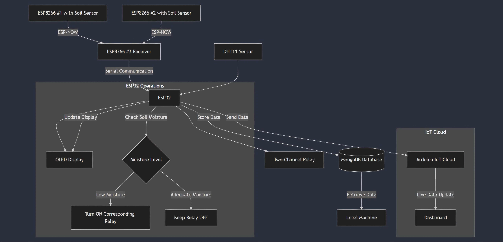
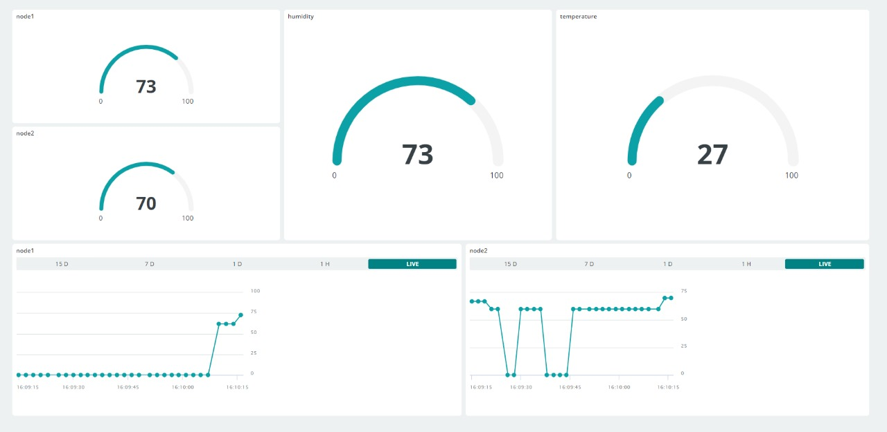
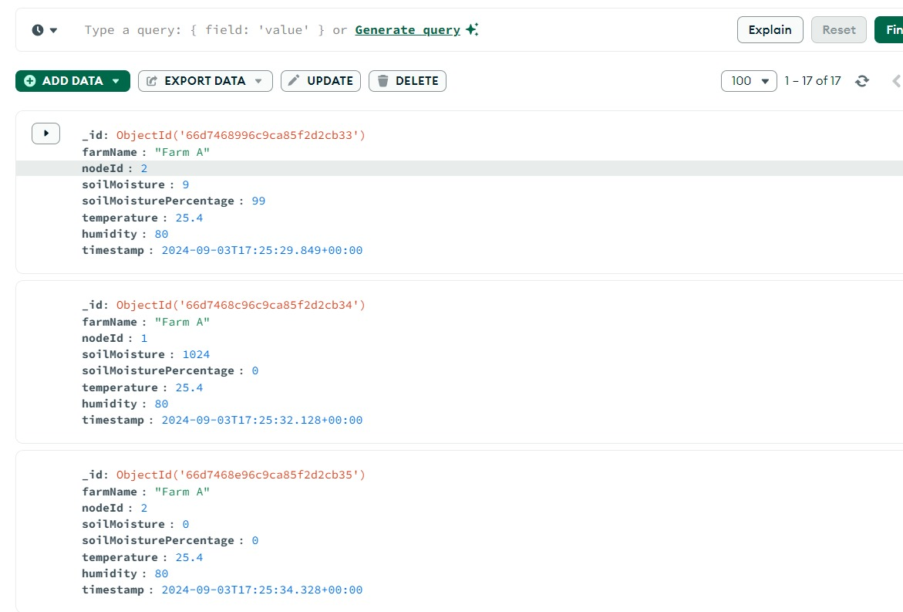

# Smart Irrigation System for Precision Farming

An IoT-based Smart Agriculture System that optimizes irrigation through real-time soil moisture monitoring and automated water management.

## 📌 Table of Contents
- [Project Overview](#project-overview)
- [Features](#features)
- [Hardware Components](#hardware-components)
- [Software & Technologies](#software--technologies)
- [System Architecture](#system-architecture)
- [Snapshots of Implementations](#-snapshots-of-implementations)
- [Usage](#usage)
- [Future Enhancements](#future-enhancements)
- [License](#license)

## 🌾 Project Overview

This Smart Irrigation System is designed to revolutionize precision farming by leveraging IoT technologies. Our prototype demonstrates the potential for significant water conservation, increased crop yields, and promotion of sustainable farming practices.

## ✨ Features

- **Multi-sensor network**: Utilizes multiple ESP8266s and an ESP32 for comprehensive data collection
- **Real-time monitoring**: Captures soil moisture, temperature, and humidity data
- **Efficient communication**: Implements ESP-NOW protocol for low-power, long-range data transmission
- **Automated irrigation**: Two-channel relay system activates based on real-time soil moisture levels
- **Local visualization**: OLED display shows sensor data and relay status for on-site monitoring
- **Cloud integration**: Live data updates to Arduino IoT Cloud for remote access and monitoring
- **Data persistence**: MongoDB database for storing historical data and enabling future analytics
- **Energy-efficient**: Smart power management for extended battery life in field deployments

## 🛠 Hardware Components

- 3x ESP8266 modules
- 1x ESP32 module
- Soil moisture sensors
- DHT11 temperature and humidity sensor
- Two-channel relay module
- OLED display
- Power supply units

## 💻 Software & Technologies

- Arduino IDE
- ESP-NOW protocol
- Arduino IoT Cloud
- MongoDB
- C++ (for microcontroller programming)

## 🏗 System Architecture
The Flowchart below illustrates the core process and interactions within the Smart Irrigation System for Precision Farming, starting from data collection via sensors to irrigation control.

## 📸 Snapshots of Implementations
Here are some snapshots showcasing the key components and working of the Smart Irrigation System for Precision Farming. These images include the physical implementation, hardware setup.

## 📊 Usage

1. Power on the system
2. Monitor real-time data on the OLED display
3. Access the Arduino IoT Cloud dashboard for remote monitoring and control
4. Analyze historical data using MongoDB queries 

## 🔮 Future Enhancements

- Implement machine learning for predictive irrigation
- Expand sensor network to cover larger agricultural areas
- Develop a mobile app for easier monitoring and control
- Integrate weather forecast data for smarter decision-making
- Implement advanced analytics for crop yield prediction

## 📄 License

This project is licensed under the MIT License - see the `LICENSE.md` file for details.

